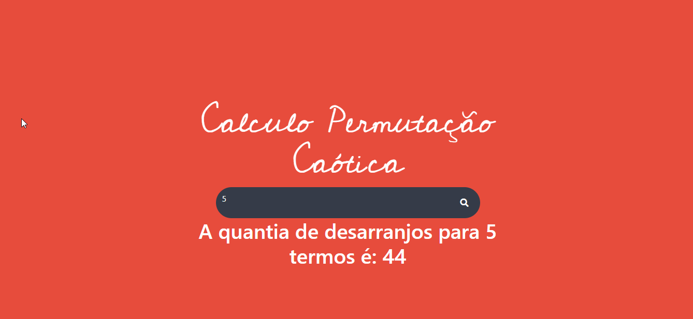

# Dessarajinator - Permutação Cáotica
> Algoritmo desenvolvido por: Bruno Pagani [@paganizera](https://www.instagram.com/paganizera/)

Uma permutação dos elementos dessa sequência é dita uma Permutação Caótica ou um Desarranjo quando nenhum dos elementos ai está na sua posição original, isto é, na i-ésima posição. Denotaremos por Dn o número de permutações caóticas de n elementos.


## Instalação

```sh
acesse: permutacaocaotica.netlify.app
```
[permutacaocaotica.netlify.app](https://permutacaocaotica.netlify.app)

## Desenvolvimento

```sh
Abra o projeto no Visual Studio Code

```

## Usage: 
    Html
    CSS
    Javascript

## Release History

* 0.0.1
    * EM DESENVOLVIMENTO

## Meta

Zanchet Luan – [@zanchetluan](https://twitter.com/zanchetluan) – luuanzanchet@outlook.com


[https://github.com/LuanZanchet/dessarajinator](https://github.com/LuanZanchet)

## Contributing

1. Fork it (<https://github.com/LuanZanchet/dessarajinator/fork>)
2. Create your feature branch (`git checkout -b feature/fooBar`)
3. Commit your changes (`git commit -am 'Add some fooBar'`)
4. Push to the branch (`git push origin feature/fooBar`)
5. Create a new Pull Request

<!-- Markdown link & img dfn's -->
[npm-image]: https://img.shields.io/npm/v/datadog-metrics.svg?style=flat-square
[npm-url]: https://npmjs.org/package/datadog-metrics
[npm-downloads]: https://img.shields.io/npm/dm/datadog-metrics.svg?style=flat-square
[travis-image]: https://img.shields.io/travis/dbader/node-datadog-metrics/master.svg?style=flat-square
[travis-url]: https://travis-ci.org/dbader/node-datadog-metrics
[wiki]: https://github.com/yourname/yourproject/wiki
